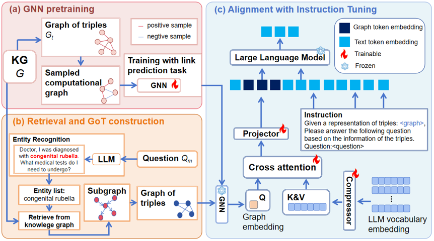

# GLAM-QA：A Concise GNN-LLM Alignment Framework for Knowledge-Enhanced Medical Question Answering

Official implementation of the paper "A Concise GNN-LLM Alignment Framework for Knowledge-Enhanced Medical Question Answering" (accepted by BIBM 2025 workshop).

## Overview



## Running

#### 0. Environment Setup: 
```shell
conda create -n glam_qa python=3.10

conda activate glam_qa
# PyTorch 2.1.0 + CUDA 12.1 

pip install --upgrade pip
pip install torch==2.1.0 torchvision==0.16.0 torchaudio==2.1.0 --index-url https://download.pytorch.org/whl/cu121

# PyG for PyTorch 2.1
pip install torch_geometric
pip install pyg_lib torch_scatter torch_sparse torch_cluster torch_spline_conv -f https://data.pyg.org/whl/torch-2.1.0+cu121.html

# Clone
git clone https://github.com/songchaocn/GLAM-QA.git
cd GLAM-QA
# Install requirements
pip install -r requirements.txt
```

#### 1. Download models:
Please download the LLM and Bert model from Huggingface at this link:[Qwen2.5-7B](https://huggingface.co/Qwen/Qwen2.5-7B) ,[bert-base-uncased](https://huggingface.co/google-bert/bert-base-uncased)

#### 2. Data Process:
```shell
cd data process
python mk_data.py
python mk_emb.py
python mk_graph_data.py
```
#### 3. GNN pre-train：
```shell
python train_gnn.py
```

#### 4. Aligenment train and test：

```shell
cd ../aligenment
python aligenment.py
```
#### 5. Eval：

```shell
cd ../eval
python eval.py
```

### Code Structure
```
.
├── aligenment
│   └── alignment.py
├── data
│  └── PubMedQA
│      ├── qa_data
│   ...
├── data_process
│   └── mk_data.py
│   └── mk_emb.py
│   └── mk_graph_data.py
│   └── train_gnn.py
├── eval
│   └── eval.py
├── README.md
├── saved_output
├── my_code 
    └── conversation.py
    └── graph_transformer.py
    └── __init__.py
    └── language_model.py
    └── layers.py
    └── model.py
    └── my_config.py
    └── my_dataloader.py
    └── my_nlp.py
    └── trainer_base.py
```

# Citation
If you find this project helpful, please cite the following paper:
```bibtex
@inproceedings{song2025glam_qa,
  title={A Concise GNN-LLM Alignment Framework for Knowledge-Enhanced Medical Question Answering},
  author={Chao Song, Xuyi Chen, Hao Zhang, Ruilin Hu, and Weibo Liang},
  booktitle={Proceedings of the IEEE International Conference on Bioinformatics and Biomedicine (BIBM)},
  year={2025},
  organization={IEEE}
}
```
